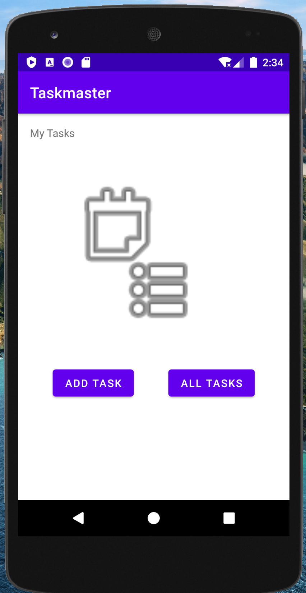
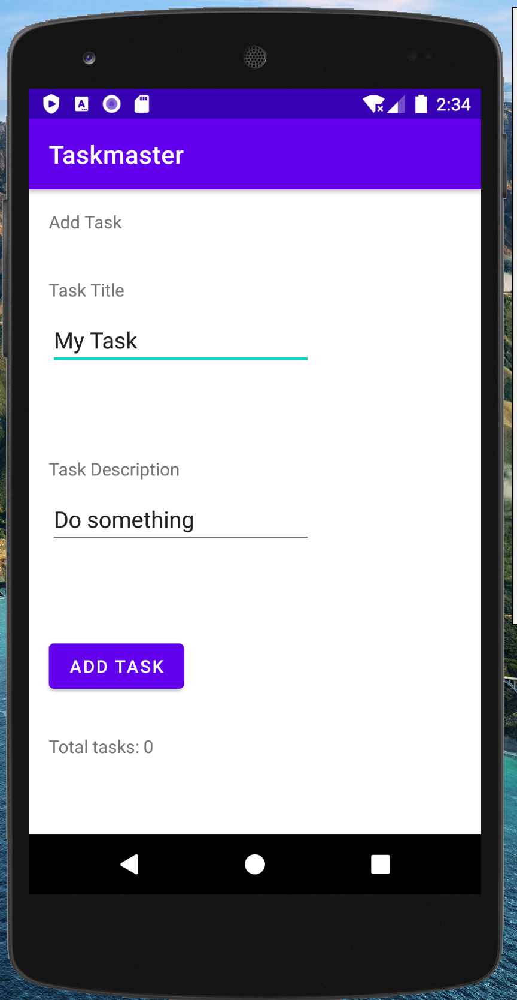
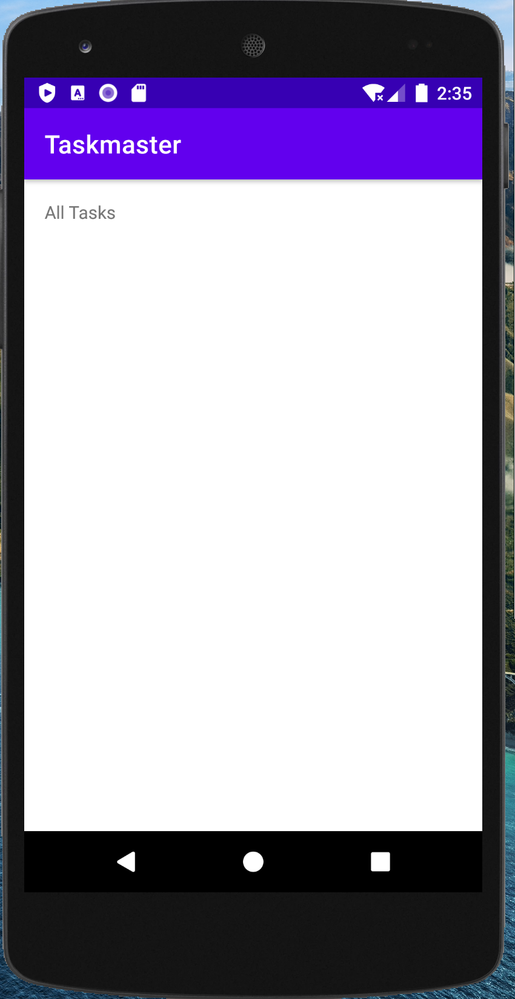
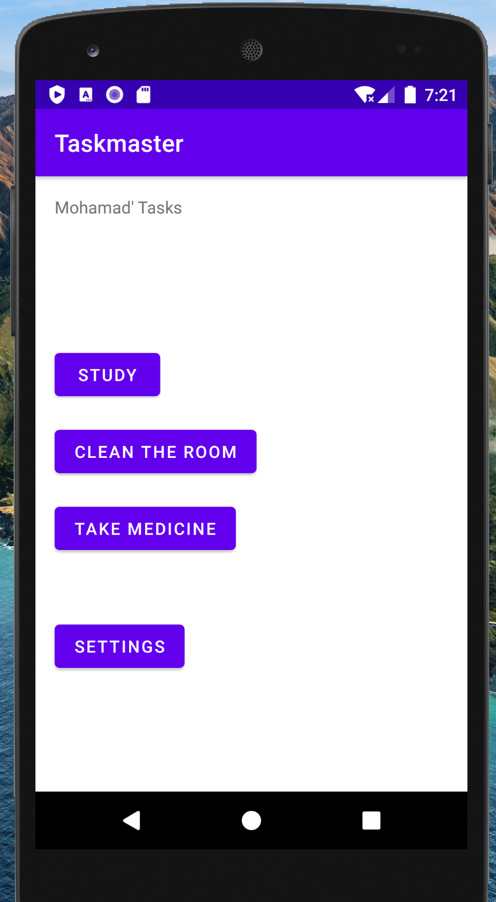
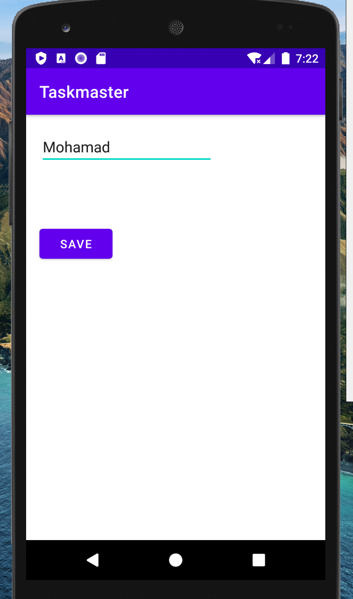

# Taskmaster Android App:

This App will contains tasks to do.. and you can add tasks and display your all tasks
There ara a few main activities:

1. `MainActivity`
2. `AddTaskActivity`
3. `AllTasksActivity`
4. `TaskDetailsActivity`
5. `SettingsActivity`

### _________________________________

***For first day changes (lab 26):***

* created the three activities and add the appropriate components inside them.
* connect them with the buttons in the MainActivity(Add Task, All Tasks).
* No functionalities yet, except the move on the activities using the previous two buttons

*Screenshots:*

MainActivity:

 
 
 
 

AddTaskActivity:

 
 
 
 

AllTasksActivity:

### _________________________________

***For second day changes (lab 27):***

* update the home page (Main Activity) to be contains main title which hold the user name (which is set by user from the settings page) and three tasks buttons, and one button for settings.
* Add TaskDetailActivity that contains title (from the tapped button of the home page), and hard coded description for now.
* Add SettingsActivity, which contain field to enter the userName, and save button to save the user name in the sharedPreferences.. to persist and access this name from the homePage.

*Screenshots:*

MainActivity:

 
 
 
 

TaskDetailsActivity:

 
 
 
 

SettingsActivity:

### _________________________________