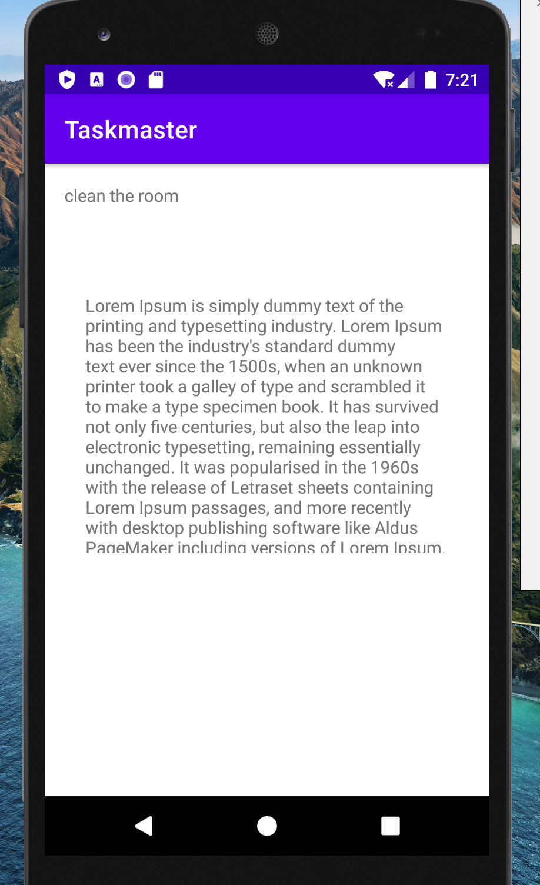

# Taskmaster Android App:

This App will contains tasks to do.. and you can add tasks and display your all tasks
There ara a few main activities:

1. `MainActivity`
2. `AddTaskActivity`
3. `AllTasksActivity`
4. `TaskDetailsActivity`
5. `SettingsActivity`

### _________________________________

***first day changes (lab 26):***

* created the three activities and add the appropriate components inside them.
* connect them with the buttons in the MainActivity(Add Task, All Tasks).
* No functionalities yet, except the move on the activities using the previous two buttons

*Screenshots:*

MainActivity:

 
 
 
 

AddTaskActivity:

 
 
 
 

AllTasksActivity:

### _________________________________

***Second day changes (lab 27):***

* update the home page (Main Activity) to be contains main title which hold the user name (which is set by user from the settings page) and three tasks buttons, and one button for settings.
* Add TaskDetailActivity that contains title (from the tapped button of the home page), and hard coded description for now.
* Add SettingsActivity, which contain field to enter the userName, and save button to save the user name in the sharedPreferences.. to persist and access this name from the homePage.

*Screenshots:*

MainActivity:

 
 
 
 

TaskDetailsActivity:

 
 
 
 

SettingsActivity:

### _________________________________

***Third day's changes (lab 28):***

* update the home page (Main Activity) to be contains main title which hold the user name (which is set by user from the settings page) and RecyclerView which hold the list of tasks and view it as a list for the user, and one button for settings.
* create a fragment to hold the style for each task..(title, body, state)
* create taskAdapter for binding the data with the view(fragment styles)
* connect them together and set onClick listener on each ViewHolder to response for user click and go on the task details page with the title of the tapped task

*Screenshots:*

MainActivity:

 
 
 
 

TaskDetailsActivity: (same as the previous one)

 
 
 
 

SettingsActivity: (same as the previous one)

### _________________________________

***Forth day's changes (lab 29):***

* update the home page to be contains main title which hold the user name (which is set by user from the settings page) and RecyclerView which hold the list of tasks and view it as a list for the user, a button for settings, and a button for add a task.
* Edit the TaskDetailsActivity to reflect the all data entered by the user (Title, Body, State), Not just the title.
* create a Room DataBase which is local db that hold the user's data (task).
* create the task entity and task DAO (Data Access Object) to let me manipulate the data in the DB (read, add, update, delete).
* Edit in the mainActivity especially in the decleration of the Adapter .. to take the list of tasks from the DB (getAllTasks())

*Screenshots:*

MainActivity:

 
 
 
 

TaskDetailsActivity:

 
 
 
 

 
 
 
 

SettingsActivity: (same as the previous one)

### _________________________________

***Forth day's changes (lab 29):***

* Add the utomated testing to the app.. using Espresso.
* assert that the basic components are displayed
* write tests that check for some functionalities are working correctly Like( addTask button, Settings and save buttons, click on the recyclerView's viewHolder...)

*Screenshots:*

No changes in the style of pages or additional activities.

### _________________________________

***Fifth day's changes (lab 29):***

* configure and add the Amplify dynamoDB to the app
* create GraphQL model as a schema and the Amplify generated it as model class.
* save and retrieve the data from the dynamoDB instead of RoomDB
* edit on styles for the fragment and the all activities.
* add spinner in the add task form to select the state of the task.
* add goBack button in the action bar to go back from the (TaskDetailsActivity, SettingsActivity, AddTaskActivity) to the MainActivity.

*Screenshots:*

MainActivity:

 
 
 
 

TaskDetailsActivity:

 
 
 
 

AddTaskActivity:
 

 
 
 
 

### _________________________________

***Sixth day's changes (lab 36):***

* configure and add the Amplify Authentication (Cognito)
* Add the Amplify pre-built UI for (Sign in, Sign up) Activity to the App.
* change the launcher Activity to be the Login Activity.
* The user must be signed in to see the home activity.
* print the userName of the user that is logged in on the action bar of the main activity
* Add Logout button to the main activity.

*Screenshots:*

MainActivity:

 
 
 
 

Sign Up:

 
 
 
 

Login :

 

 
 
 
 

### _________________________________

***Seventh day's changes (lab 37):***

* Add and configure amplify s3 storage.
* Add the ability to attach a file when create a task.
* upload the files to the s3 storage.
* Display the file in the task details page, (if it was an image; display it, If it isn't image, display a link for this file)

*Screenshots:*

MainActivity:

 
 
 
 

Add task:

 
 
 
 

Task Details :

 
 
 

 
 
 
 

### _________________________________

***Changes of lab 38(Notification):***

* Add Notifications to the app.
* configure and add the Firebase notifications service.
* send from the firebase console messages to the app and receive them as notifications.

*Screenshots:*

Notification:

 
 
 
 

### _________________________________

***Changes of lab 41(intent filter):***

* Add the ability to share an image from external apps to add it to new task.
* when an image shared from external app, the button attach file will be disabled.
* the shared image will be uploaded to S3 storage and will be displayed in the tast details activity when the task is clicked from the main activity.

*Screenshots:*

Select an image to share:

share selection list:

Add task Activity:

The added task in main Activity:

The task details activity:

 
 
 
 

### _________________________________

***Changes of lab 42(Location):***

* Add Current Location to the task added.
* request Location permission from the users
* store the location as Altitude and Longitude values for each task Added.

*Screenshots:*

Location permission:

 
 
 
 

### _________________________________